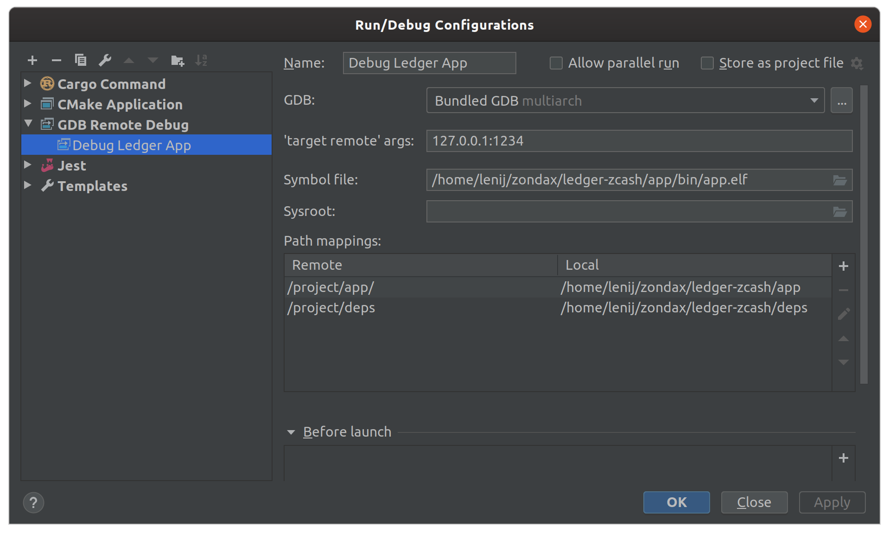

## How to debug a ledger app?

You can use vscode or clion to debug the app. We recommend using CLion but we provide a vscode (unsupported) configuration too.

### Preconditions

If you are using CLion, you need to a configuration file in your home directory: `$HOME/.gdbinit` with the following content:

```
set auto-load local-gdbinit on
add-auto-load-safe-path /
```

### Warnings

There are a few things to take into account when enabling Ledger App debugging:

- Once you enable the local .gdbinit that is located in your project workspace. You **will break** local Rust debugging in your host. The reason is that debugging unit tests will use the same `.gdbinit` configuration that sets the environment to ARM. We are looking at some possible fixes. For now, if you want to debug unit tests instead of the ledger app, you need to comment out the lines in `.gdbinit`

### Debugging

1. Build your app

    ```bash
    make
    ```

2. Define your debug scenario

    Open `tests/zemu/tools/debug.mjs` and look for the line:

    ```bash
    /// TIP you can use zemu commands here to take the app ...
    ```

    You can adjust this code to get the emulator to trigger a breakpoint in your app:
    - send clicks
    - send APDUs, etc

3. Launch the emulator in debug mode

    > If you didnt install Zemu yet (previous section), then run `make zemu_install`

    ```bash
    make zemu_debug
    ```

    The emulator will launch and immediately stop. You should see a light blue window

4. Configure Clion debugger

    Your configuration should look similar to this:

     

    Check that the path mappings are correct

5. Start CLion debugger

    You will hit a breakpoint in main.
    Add breakpoints in other places and continue.

    Enjoy :)

